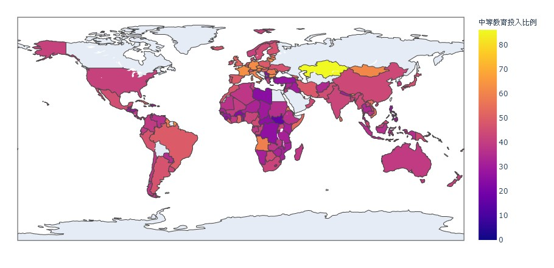
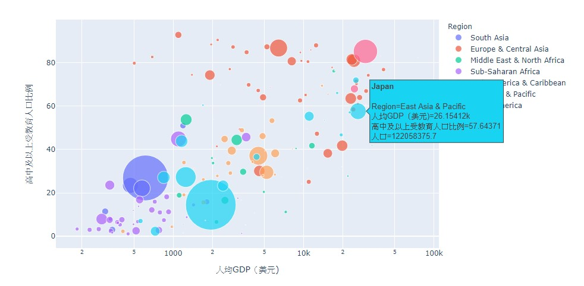
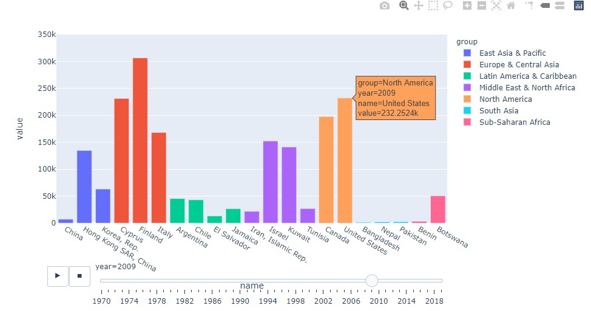
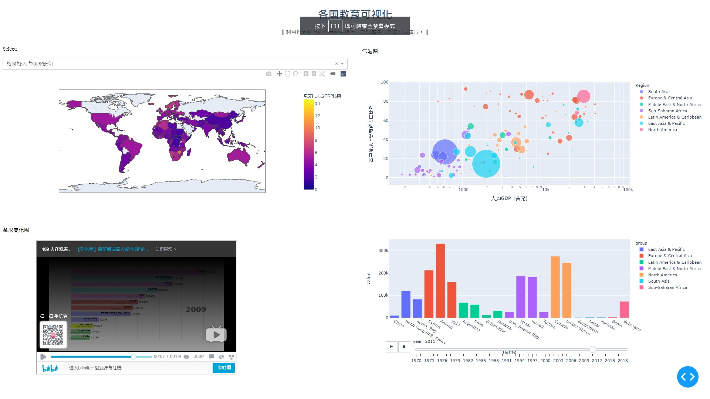

# Data Visualization
It's a project in Class Data Visualization in 2019 Semester 2. 

- Data source: WDI Data
- Target: Visualize the educational indicators and even have a user interaction with web
- Tools: Python plotly.express/matplotlib to plot
- Platform: Dash and Heroku

1. Step 1 : Data Download
2. Step 2 : Data Processing
3. Step 3 : Plot by plotly.express
    - World Map
    
    - Bubble Plot
    
    - Histrogram Animation
    
4. Step 4 : Combine into web

    There is a local web when running out the dash related codes.
    
5. Step 5 : upload to Heroku (unsolved)

    It needs a file including `main.py` `requirements.txt` `runtime.txt` `Procfile`.
    In the Heroku website, it helps to construct the website by some git command.
